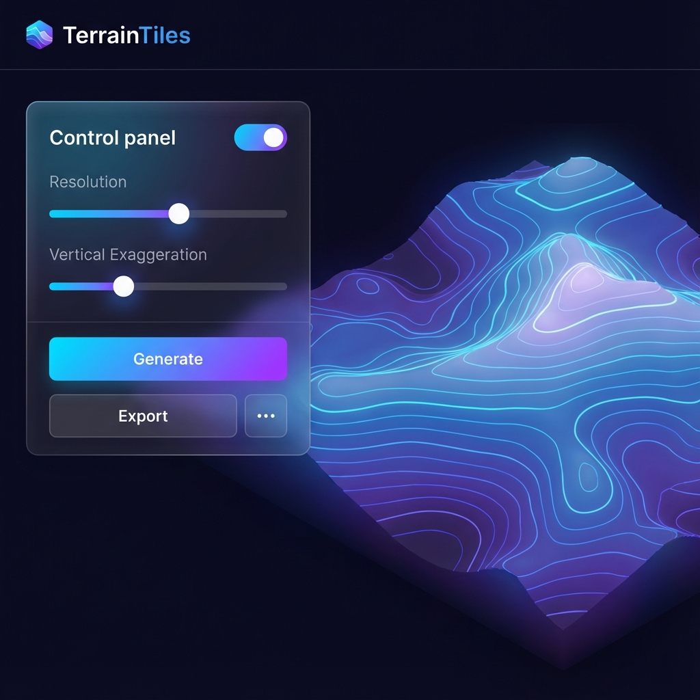

# TerrainTiles 🏔️

**TerrainTiles** (3DMapMaker) is a high-performance web application designed to bridge the gap between digital geographic data and physical 3D models. It allows users to select any area on Earth, visualize it in an interactive 3D viewer, and export it as 3D-printable STL files or SVG contour maps.

Suggested uses for Topography, Classrooms, DnD, Model Railroading etc.



## 🚀 Features

- **Global Map Selection**: Use an interactive Leaflet-based map to select any region.
- **Real-time 3D Preview**: Visualize terrain instantly with Three.js-powered rendering.
- **Smart Tiling system**: Automatically splits large areas into multiple tiles that fit your 3D printer's bed.
- **Customizable Topography**:
  - **Vertical Exaggeration**: Enhance elevation features for better 3D prints.
  - **Smoothing**: Reduce noise from digital elevation models (DEM).
  - **Resolution Control**: Balance between detail and performance.
- **Professional Exports**:
  - **multi-tile STL**: Ready for 3D printing, pre-calculated to real-world scales (e.g., 1:25,000).
  - **SVG Contours**: High-quality vector files for laser cutting or topographic mapping.
- **Scale Accuracy**: Define target scales and base thicknesses for precise physical models.

---

## 🛠️ Technology Stack

- **Framework**: [Next.js 14](https://nextjs.org/) (App Router)
- **3D Rendering**: [Three.js](https://threejs.org/) via [@react-three/fiber](https://github.com/pmndrs/react-three-fiber)
- **Mapping**: [Leaflet](https://leafletjs.com/) & [React-Leaflet](https://react-leaflet.js.org/)
- **Data Source**: [AWS Terrain Tiles](https://registry.opendata.aws/terrain-tiles/) (Mapzen Terrarium format)
- **Language**: TypeScript

---

## 🚦 Getting Started

### Prerequisites

- Node.js 18.x or later
- npm or yarn

### Installation

1. Clone the repository:
   ```bash
   git clone https://github.com/Milo2234/3DMapMaker.git
   cd 3DMapMaker/terrain-tiles
   ```

2. Install dependencies:
   ```bash
   npm install
   ```

3. Start the development server:
   ```bash
   npm run dev
   ```

4. Open [http://localhost:3000](http://localhost:3000) in your browser.

---

## 📖 How to Use

1. **Select Area**: Pan and zoom the map to find your area of interest. Use the selection box to define the bounds.
2. **Fetch Terrain**: Click "Generate Terrain" to download elevation data.
3. **Adjust Settings**:
   - Use **Vertical Exaggeration** to make mountains pop.
   - Adjust **Resolution** for finer surface detail.
   - Set **Target Scale** (e.g., 50000 for 1:50,000) to ensure your model matches real-world dimensions.
4. **Export**: 
   - Click **Export STL** to download 3D models. Large areas will automatically download as a series of tiles (e.g., `tile_1_1.stl`, `tile_1_2.stl`).
   - Click **Export SVG** for contour lines.

---

## ⚠️ Limitations & Roadmap

### Current Limitations
- **Resolution**: Data is sourced from AWS Terrain Tiles which have a maximum resolution of approximately 10 meters per pixel (Zoom 14).
- **Water Bodies**: Bathymetry (underwater depth) is not supported in the current data source; water surfaces are treated as flat at sea level or lake elevation.
- **Browser Memory**: Extremely large high-resolution fetches may hit browser memory limits during STL generation.
- **API Rate Limits**: Uses public AWS tile endpoints; subject to their availability.

### Roadmap
- [ ] Support for higher-resolution LiDAR data uploads.
- [ ] Integration with Mapbox RGB-Terrain for even higher quality.
- [ ] Preset textures (Satellite imagery overlay).
- [ ] In-browser STL repair and optimization.

---

## 📄 License

This project is licensed under the MIT License - see the LICENSE file for details.

---

## 🙏 Acknowledgments

- [Mapzen](https://www.mapzen.com/) for the original Terrarium elevation format.
- [AWS Open Data Program](https://registry.opendata.aws/) for hosting global elevation tiles.
- The Three.js and React-Three-Fiber community for making 3D on the web accessible.
